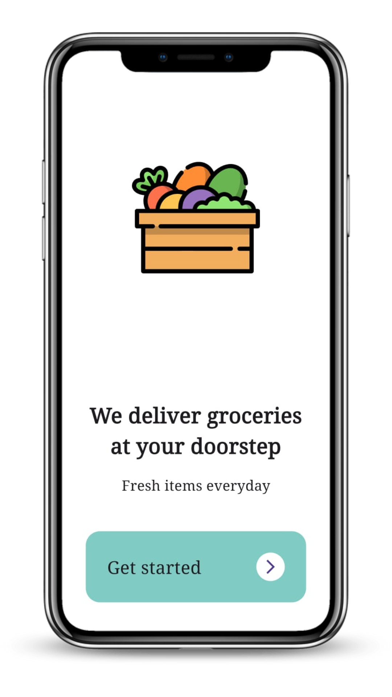
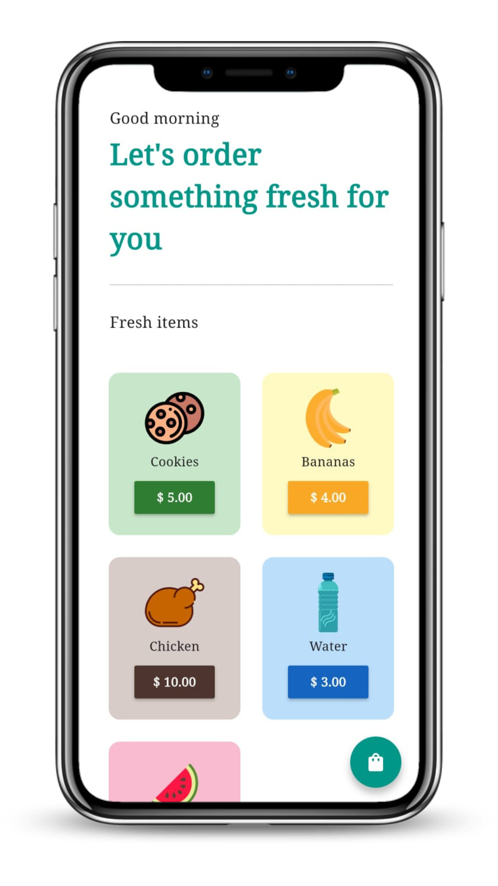
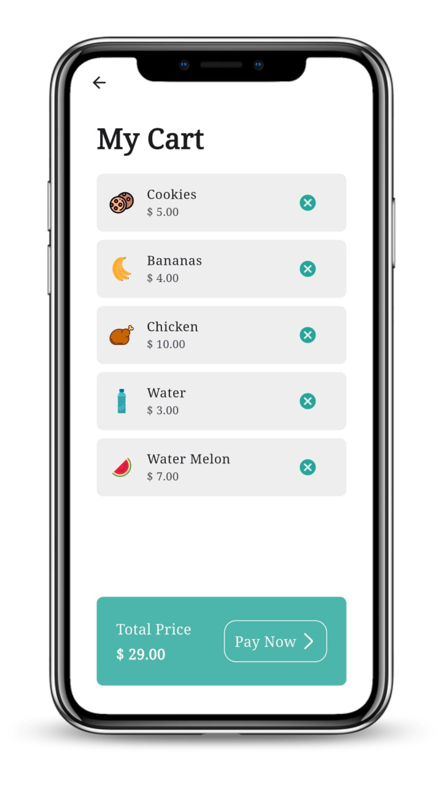

  
  
  

A clean and simple Flutter app for a grocery shopping experience

✨ Features

  ✅ Intro page with branding and navigation

  🛍️ Home page listing grocery items (with "Add to Cart" functionality)

  🛒 Cart page showing:

   - Items added

   - Option to remove items

   - Total amount

   - “Pay Now” button (UI only)

🔧 Tech Stack

  Flutter

  Dart

  Provider for state management

👨‍💻 Author

  Osama Bashir